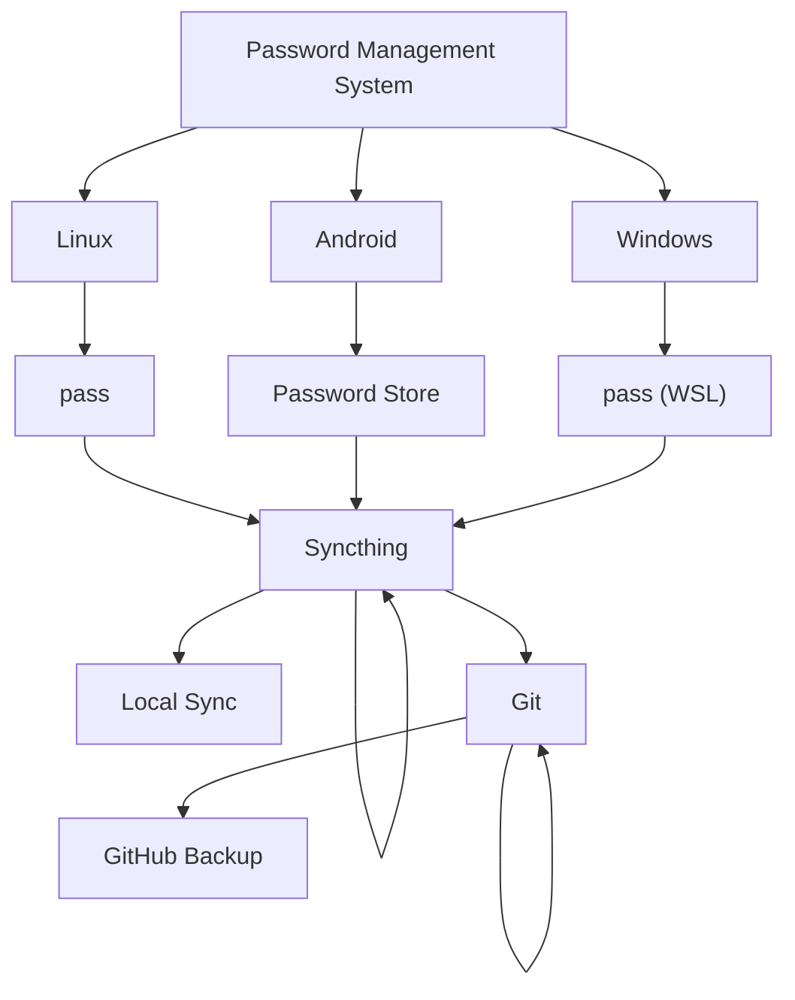

```mermaid
graph TD
    A[Password Management System] --> B[Linux]
    A --> D[Android]
    A --> C[Windows]
    B --> E[pass]
    D --> F[Password Store]
    C --> G["pass (WSL)"]
    E --> I[Syncthing]
    F --> I
    G --> I
    I --> I
    I --> J[Local Sync]
    I --> K[Git]
    K --> K
    K --> L[GitHub Backup]
```
[[pass]]
#linux #storage #encryption #git #syncthing 