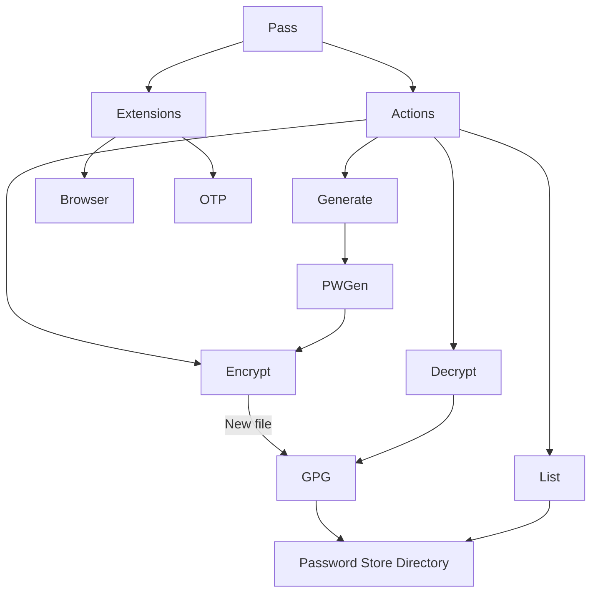

```mermaid
graph TB;
    PM[Pass] --> Act[Actions]
    Act --> Enc[Encrypt] -->|New file| GPG[GPG] --> Store[Password Store Directory]
    Act --> Dec[Decrypt] --> GPG
    Act --> List[List] --> Store
    Act --> Gen[Generate] --> PWGen[PWGen] --> Enc
    
    PM --> Ext[Extensions]
    Ext --> Browser[Browser]
    Ext --> OTP[OTP]
```
[[GPG]]
#linux #encryption 